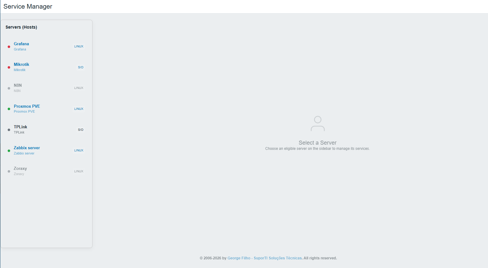
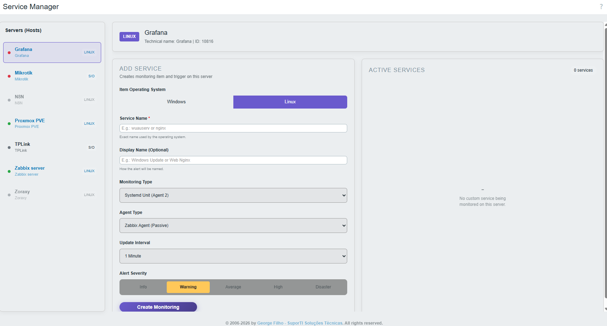
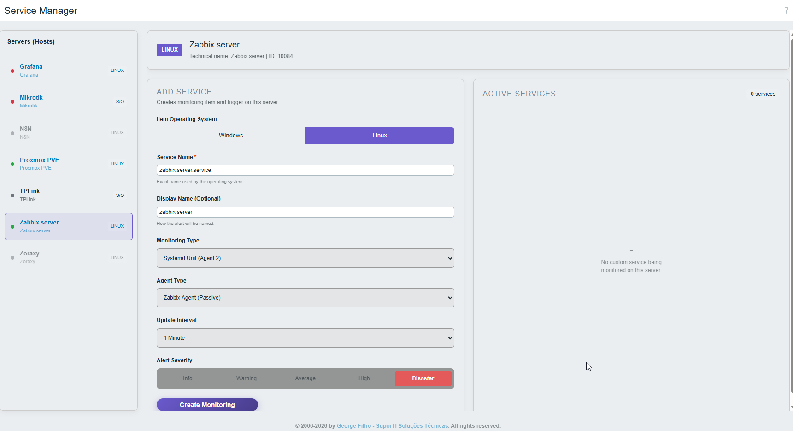
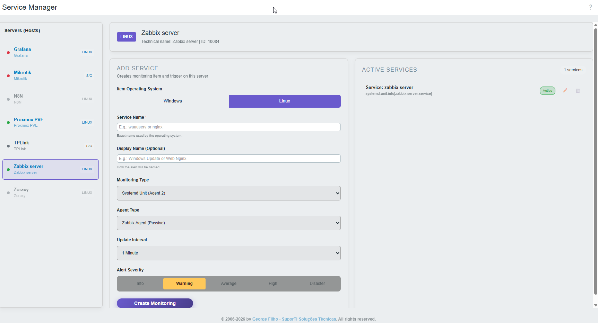

# Zabbix Service Manager

_Read this in other languages: [](README.md)_

O **Zabbix Service Manager** é um módulo moderno e intuitivo para a Interface Web do Zabbix, projetado para adicionar capacidades específicas de monitoramento de serviços diretamente aos hosts. Ele se integra perfeitamente à interface do Zabbix, adicionando uma visualização dedicada para gerenciar e monitorar serviços específicos de hosts.

Desenvolvido por **George Filho**.

---

## 🎯 Principais Recursos

- **Visualização Dedicada:** Fornece uma visualização dedicada para gerenciar e monitorar serviços para cada host específico.
- **Fácil Gerenciamento:** Ações integradas para visualizar, adicionar, salvar e excluir configurações de serviços.
- **Integração Simples:** Instalação simples (plug-and-play) como um módulo padrão do Zabbix.
- **Integração Nativa com Zabbix:** Implementado de forma segura usando classes nativas da interface do Zabbix, totalmente compatível com a arquitetura do Zabbix 7.0+.

---

## 📋 Pré-requisitos

Antes de instalar e usar este módulo, certifique-se de que:

1. Você está executando o **Zabbix Frontend 6.0 ou superior** (otimizado para 7.0+).
2. O usuário do servidor web (ex: `www-data`, `apache` ou `nginx`) tenha permissões de leitura para o diretório do módulo.

---

## 🚀 Instalação

A instalação de módulos no frontend do Zabbix é simples e rápida.

1. **Baixe ou clone este repositório:**
   Baixe os arquivos do módulo para o seu servidor.

2. **Copie para o diretório de módulos do Zabbix:**
   Mova a pasta do módulo para o diretório `modules` da sua interface web do Zabbix. 
   **CRÍTICO:** O nome da pasta deve ser exatamente `servicemanager` para corresponder à configuração do módulo.

   O caminho padrão geralmente é:
   ```bash
   /usr/share/zabbix/ui/modules/servicemanager
   # ou
   /usr/share/zabbix/modules/servicemanager
   ```

3. **Registre o Módulo no Frontend:**
   - Faça login na interface web do Zabbix como Super Admin.
   - Navegue até **Administração** → **Geral** → **Módulos**.
   - Clique no botão **"Escanear diretório"** no canto superior direito.
   - O módulo **"Zabbix Service Manager"** deve aparecer na lista.
   - Clique no link **Desabilitado** na coluna de Status para alterá-lo para **Habilitado**.

---

## 💻 Como Usar

Após a ativação, um novo menu estará disponível para facilitar suas operações diárias.

1. Navegue até **Monitoramento** → **Service Manager** no menu principal.
2. A visualização do módulo será aberta, permitindo que você selecione e monitore os serviços específicos para os seus hosts.
3. Use a interface para adicionar novos serviços ou remover os existentes conforme necessário.

---

## 🛠️ Detalhes Técnicos e Referências de Desenvolvimento

Este módulo é construído seguindo as Diretrizes de Desenvolvimento de Módulos do Zabbix:

- **Arquitetura MVC:**
  - **Controllers (Controladores):** Localizados em `actions/`. Lidam com rotas e ações de dados como visualizar, salvar e excluir.
  - **Views (Visualizações):** Localizadas em `views/`. Renderizam a estrutura da interface do usuário.
- **Segurança (CSP):** As folhas de estilo são carregadas através da propriedade `assets` no arquivo `manifest.json`.

## 📂 Estrutura de Diretórios

Esta é a estrutura de arquivos padrão do módulo Zabbix Service Manager:

```text
servicemanager/
├── manifest.json                  # Configuração do módulo e registro de assets
├── Module.php                     # Classe principal do módulo e registro de menu
├── README.md                      # Documentação em Inglês
├── README.pt-br.md                # Documentação em Português
├── README_modelo.md               # Modelo de documentação (referência)
├── actions/
│   ├── ServiceManagerDelete.php   # Ação para excluir serviços
│   ├── ServiceManagerSave.php     # Ação para salvar serviços
│   └── ServiceManagerView.php     # Controlador da página principal (view)
├── assets/
│   ├── css/
│   │   └── service.manager.css    # Estilos do módulo
│   └── images/
│       ├── image-01.png           # Capturas de tela
│       ├── image-02.png
│       ├── image-03.png
│       └── image-04.png
└── views/
    └── service.manager.view.php   # Estrutura e componentes da UI
```

---

## 🖼️ Capturas de Tela

Esta seção demonstra os recursos visuais do módulo.

### 1. Visão Geral (Dashboard)


*Interface principal do Service Manager.*

### 2. Detalhes dos Serviços


*Visualização dos serviços específicos.*

### 3. Adicionar/Editar Serviços


*Gerenciamento das configurações de serviços nos hosts.*

### 4. Opções Avançadas


*Recursos adicionais do Service Manager.*

---

## 📄 Licença e Créditos

**Copyright &copy; 2006-2026 por [George Filho](https://georgeofilho.github.io).**

Todos os direitos reservados.
